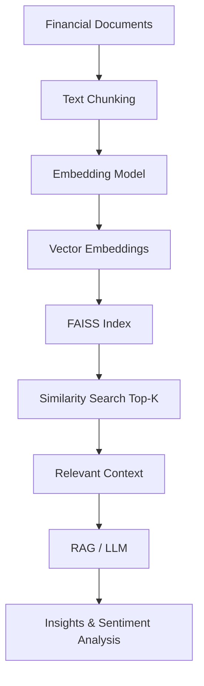
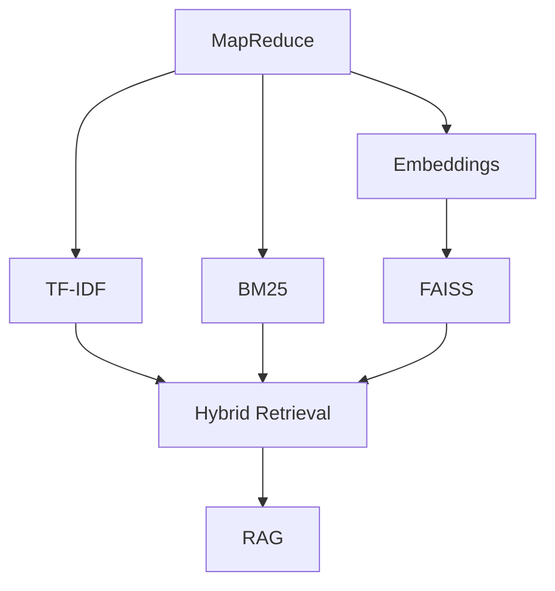

# ⚡ FAISS (Facebook AI Similarity Search)

## 📌 Overview

**FAISS (Facebook AI Similarity Search)** is an open-source library developed by Meta AI for efficient similarity search and clustering of dense vectors (embeddings).

It enables fast retrieval across millions or billions of vectors and is a core component in modern AI systems such as:

* Retrieval-Augmented Generation (RAG)
* Semantic Search
* Recommendation Systems
* Financial Intelligence Platforms

In this project, FAISS acts as the **semantic retrieval engine** powering contextual understanding of Brazilian FIIs.

---

## 🧠 Core Concept

Traditional systems rely on **exact keyword matching**.

FAISS operates differently:

> It retrieves information based on **semantic similarity (meaning)** rather than exact words.

This allows the system to detect:

* Implicit signals
* Contextual relationships
* Market narratives

---

## ⚙️ How FAISS Works



---

### Step-by-step:

1. Documents are split into chunks
2. Each chunk is converted into embeddings
3. Embeddings are indexed in FAISS
4. A query is transformed into a vector
5. FAISS retrieves nearest neighbors
6. Results are used by the LLM

---

## 🔍 Semantic Retrieval (Key Insight)

* **Embeddings** = represent meaning as vectors
* **FAISS** = finds closest meanings in vector space

> The system no longer asks *"where is this word?"*
> It asks *"where is this idea?"*

---

## 🚀 Why FAISS is Critical in This Project

Financial data (FIIs) contains:

* Noise
* Indirect language
* Sentiment-driven narratives

Traditional methods (TF-IDF, BM25):

* Capture explicit mentions
* Fail on implicit meaning

FAISS enables:

* Context-aware retrieval
* Detection of latent sentiment
* Discovery of hidden relationships

---

## 🧩 Integration with Hybrid Retrieval

FAISS is part of a **multi-layer retrieval system**:



---

### Role of Each Component

| Component  | Function                |
| ---------- | ----------------------- |
| MapReduce  | Data structuring        |
| TF-IDF     | Term importance         |
| BM25       | Keyword precision       |
| Embeddings | Semantic representation |
| FAISS      | Similarity search       |
| RAG        | Insight generation      |

---

## 🧠 Application to FIIs

Example:

Query:

```text
"Logistics funds under pressure"
```

FAISS can retrieve:

* Discussions about *HGLG11* (even without explicit mention)
* News about warehouse vacancy
* Market sentiment on logistics sector

---

### What This Enables

* Detection of **implicit market signals**
* Aggregation of **distributed sentiment**
* Understanding of **investor behavior**

---

## 🔁 FAISS in RAG Pipeline


---

## ⚡ Key Features

| Feature       | Description                    |
| ------------- | ------------------------------ |
| Vector Search | Similarity-based retrieval     |
| ANN           | Approximate Nearest Neighbor   |
| GPU Support   | High-performance scaling       |
| CPU Support   | Efficient fallback             |
| Scalability   | Millions → billions of vectors |

---

## ✅ Advantages

* Extremely fast
* Scalable
* Context-aware
* Enables semantic intelligence
* Essential for RAG systems

---

## ⚠️ Limitations

* Depends on embedding quality
* Approximate search trade-offs
* Low interpretability

---

## 🔮 Conceptual Insight

FAISS transforms:

* Search → **Semantic Navigation**
* Data → **Meaning Space**

> It enables systems to operate in a **cognitive-like retrieval paradigm**.

---

## 🔗 Connection to Conceptual Foundations

For deeper theoretical context:

📄 `docs/Conceptual Foundations.md`

---

## 🧠 Final Insight

FAISS is not just a tool — it is the **core enabler of semantic intelligence**.

When combined with:

* BM25 → precision
* TF-IDF → statistical grounding
* RAG → reasoning

> FAISS becomes the bridge between **language, meaning, and financial insight**.

---
