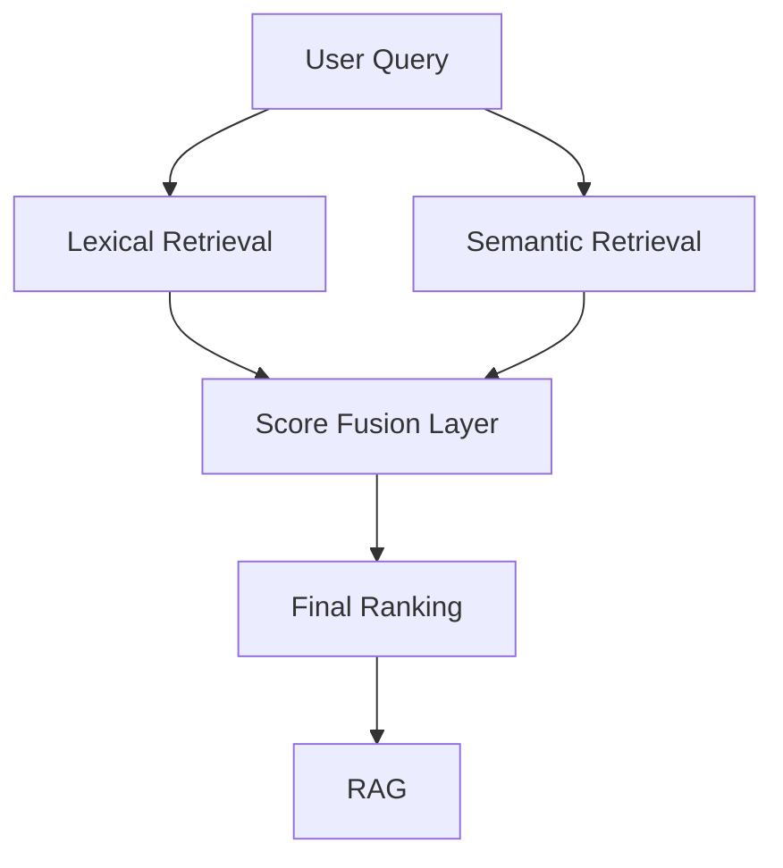

RETR# 🧠 Retrieval Strategy

## 📌 Overview

The retrieval strategy defines how the system identifies, ranks, and delivers relevant information to downstream components.  

This project adopts a **hybrid, multi-layered retrieval architecture**, combining lexical and semantic approaches for maximum performance.  

---

## 🏗️ Architecture

---

## ⚙️ Core Components

### 1. Lexical Retrieval

* TF-IDF / BM25 
* Captures exact keyword matches 
* High precision for structured queries  

 

### 2. Semantic Retrieval

* Embeddings + FAISS 
* Captures meaning and contextual similarity 
* Enables understanding beyond keywords  

 

### 3. Fusion Layer

* Combines lexical and semantic scores 
* Techniques: 

  * Weighted scoring 
  * Rank fusion 
  * Reciprocal Rank Fusion (RRF)  

  

### 4. Ranking Layer

* Produces final Top-K results 
* Optimized for relevance and diversity  

  

## 🎯 Objectives

The retrieval strategy is designed to maximize:  

* Precision (exact relevance) 
* Recall (coverage of relevant data) 
* Contextual understanding  

  

## 🔗 Integration with RAG

* Supplies high-quality context to LLMs 
* Improves answer reliability 
* Reduces hallucination risk  

  

## 🧠 Application in FIIs

* Multi-source financial signal extraction 
* Detection of relevant market events 
* Contextual clustering of news and reports 
* Enhanced investment intelligence  

  

## 🚀 Advantages

* Combines strengths of multiple retrieval paradigms 
* Improves robustness and accuracy 
* Scales to large datasets  

  

## ⚠️ Limitations

* Increased system complexity 
* Requires tuning and calibration 
* Dependent on embedding quality  

  

## 📚 Conceptual Reference

See: 

`docs/Conceptual Foundations.md

  

## 🧾 Conclusion

The retrieval strategy represents the **core intelligence engine** of the system, enabling effective transformation of raw data into meaningful and actionable insights.  

---
GY.md
